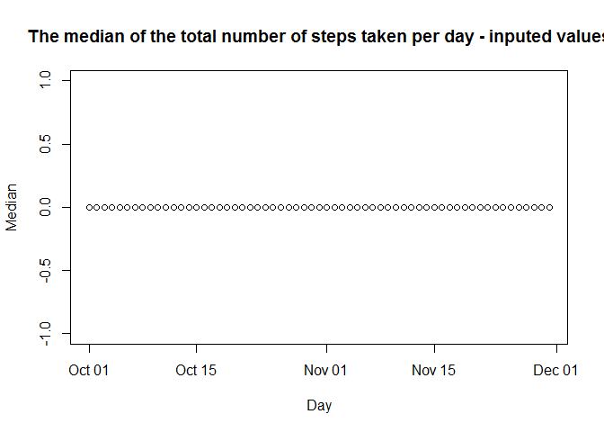

## Loading and preprocessing the data


```r
# Clear workspace
rm(list = ls())
   
# Load libraries
library(ggplot2)

# Set language to En
Sys.setlocale(category = "LC_ALL", locale = "english")
```


```r
unzip("./activity.zip")

fileName <- "activity.csv"

dataDf <- read.csv(fileName, sep = ",", stringsAsFactors = F, na.strings = "NA", 
                   header = T, quote = "\"", colClasses = c("numeric", "character", "numeric"))

dataDf$date <- as.Date(dataDf$date, "%Y-%m-%d")

head(dataDf)
```

```
##   steps       date interval
## 1    NA 2012-10-01        0
## 2    NA 2012-10-01        5
## 3    NA 2012-10-01       10
## 4    NA 2012-10-01       15
## 5    NA 2012-10-01       20
## 6    NA 2012-10-01       25
```

```r
str(dataDf)
```

```
## 'data.frame':	17568 obs. of  3 variables:
##  $ steps   : num  NA NA NA NA NA NA NA NA NA NA ...
##  $ date    : Date, format: "2012-10-01" "2012-10-01" ...
##  $ interval: num  0 5 10 15 20 25 30 35 40 45 ...
```


## What is mean total number of steps taken per day?


```r
# Remove NA values
dataWithoutNaDf <- dataDf[!is.na(dataDf$steps), ]

# Calculate the total number of steps taken per day
aggByDaySumDf <- aggregate(steps ~ date, dataWithoutNaDf, sum)

# Make a histogram of the total number of steps taken each day
hist(aggByDaySumDf$steps, main = "Histogram of the total number of steps taken each day")
```

<!-- -->

```r
# Calculate and report the mean and median of the total number of steps taken per day
aggByDayMeanDf <- aggregate(steps ~ date, dataWithoutNaDf, mean)

plot(aggByDayMeanDf$date, aggByDayMeanDf$steps, main = "The mean of the total number of steps taken per day", xlab = "Day", ylab = "Mean")
```

<!-- -->

```r
aggByDayMedianDf <- aggregate(steps ~ date, dataWithoutNaDf, median)

plot(aggByDayMedianDf$date, aggByDayMedianDf$steps, main = "The median of the total number of steps taken per day", xlab = "Day", ylab = "Median")
```

<!-- -->


## What is the average daily activity pattern?


```r
# Make a time series plot of the 5-minute interval (x-axis) and the average number of steps taken, averaged across all days (y-axis)
timeDf <- aggregate(steps ~ interval, dataWithoutNaDf, mean)

plot(timeDf$interval, timeDf$steps, xlab = "5-minute interval", ylab = "Average number of steps", type = "l")
```

<!-- -->

```r
# Which 5-minute interval, on average across all the days in the dataset, contains the maximum number of steps?
timeDf[which(timeDf$steps == max(timeDf$steps)), ]
```

```
##     interval    steps
## 104      835 206.1698
```

## Imputing missing values


```r
# Calculate and report the total number of missing values in the dataset (i.e. the total number of rows with NAs)
noOfNa <- table(is.na(dataDf$steps))["TRUE"]
noOfNa
```

```
## TRUE 
## 2304
```

```r
# Devise a strategy for filling in all of the missing values in the dataset. 
# Random sample of steps' values from dataframe without NA values
set.seed(1)
randomStepsValues <- sample(dataWithoutNaDf$steps, noOfNa)

# Create a new dataset that is equal to the original dataset but with the missing data filled in.
inputedDf <- dataDf
inputedDf[is.na(dataDf$steps), c("steps")] <- randomStepsValues

# Make a histogram of the total number of steps taken each day  
aggByDaySumInputedDf <- aggregate(steps ~ date, inputedDf, sum)

hist(aggByDaySumInputedDf$steps, main = "Histogram of the total number of steps taken each day - inputed values")
```

<!-- -->

```r
# Calculate and report the mean and median total number of steps taken per day. 
aggByDayMeanInputedDf <- aggregate(steps ~ date, inputedDf, mean)

plot(aggByDayMeanInputedDf$date, aggByDayMeanInputedDf$steps, main = "The mean of the total number of steps taken per day - inputed values", xlab = "Day", ylab = "Mean")
```

<!-- -->

```r
aggByDayMedianInputedDf <- aggregate(steps ~ date, inputedDf, median)

plot(aggByDayMedianInputedDf$date, aggByDayMedianInputedDf$steps, main = "The median of the total number of steps taken per day - inputed values", xlab = "Day", ylab = "Median")
```

<!-- -->

```r
# Do these values differ from the estimates from the first part of the assignment? 
tmp1Df <- aggByDayMeanDf
tmp1Df <- cbind(tmp1Df, data.frame("label" = "Not inputed data"))

tmp2Df <- aggByDayMeanInputedDf
tmp2Df <- cbind(tmp2Df, data.frame("label" = "Inputed data"))

tmpDf <- rbind(tmp1Df, tmp2Df)

ggplot2::ggplot(data = tmpDf, aes(x = date, y = steps, colour = label)) + 
  ggplot2::geom_line() +
  ggplot2::ggtitle("Mean difference")
```

<!-- -->

```r
tmp1Df <- aggByDayMedianDf
tmp1Df <- cbind(tmp1Df, data.frame("label" = "Not inputed data"))

tmp2Df <- aggByDayMedianInputedDf
tmp2Df <- cbind(tmp2Df, data.frame("label" = "Inputed data"))

tmpDf <- rbind(tmp1Df, tmp2Df)

ggplot2::ggplot(data = tmpDf, aes(x = date, y = steps, colour = label)) + 
  ggplot2::geom_line() +
  ggplot2::ggtitle("Median difference")
```

<!-- -->

```r
# What is the impact of imputing missing data on the estimates of the total daily number of steps?
tmp1Df <- aggByDaySumDf
tmp1Df <- cbind(tmp1Df, data.frame("label" = "Not inputed data"))

tmp2Df <- aggByDaySumInputedDf
tmp2Df <- cbind(tmp2Df, data.frame("label" = "Inputed data"))

tmpDf <- rbind(tmp1Df, tmp2Df)

ggplot2::ggplot(data = tmpDf, aes(x = date, y = steps, colour = label)) + 
  ggplot2::geom_line() +
  ggplot2::ggtitle("Inputed and non inputed data for total daily number of steps")
```

<!-- -->

## Are there differences in activity patterns between weekdays and weekends?


```r
# Create a new factor variable in the dataset with two levels – “weekday” and “weekend” indicating whether a given date is a weekday or weekend day.
indxs <- which(weekdays(inputedDf$date) %in% c("Saturday", "Sunday"))
inputedWWDf <- cbind(inputedDf, "wwDays" = "")
inputedWWDf[indxs, "wwDays"] <- "weekends"
inputedWWDf[-c(indxs), "wwDays"] <- "weekdays"
inputedWWDf$wwDays <- as.factor(inputedWWDf$wwDays)

# Make a panel plot containing a time series plot of the 5-minute interval (x-axis) and the average number of steps taken, averaged across all weekday days or weekend days (y-axis).

aggDf <- aggregate(steps ~ wwDays + interval, inputedWWDf, mean)

ggplot(aggDf, aes(x = interval, y = steps)) + 
  geom_line() +
  facet_grid(wwDays ~ .)
```

<!-- -->
